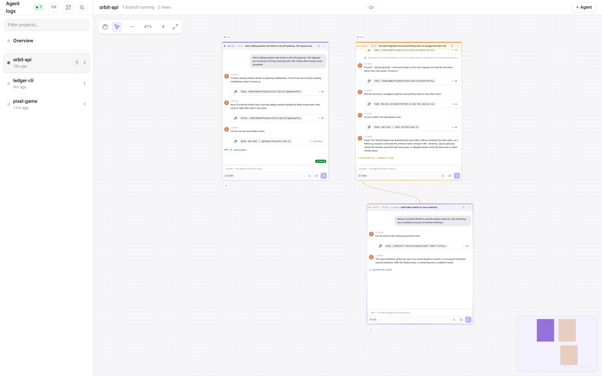
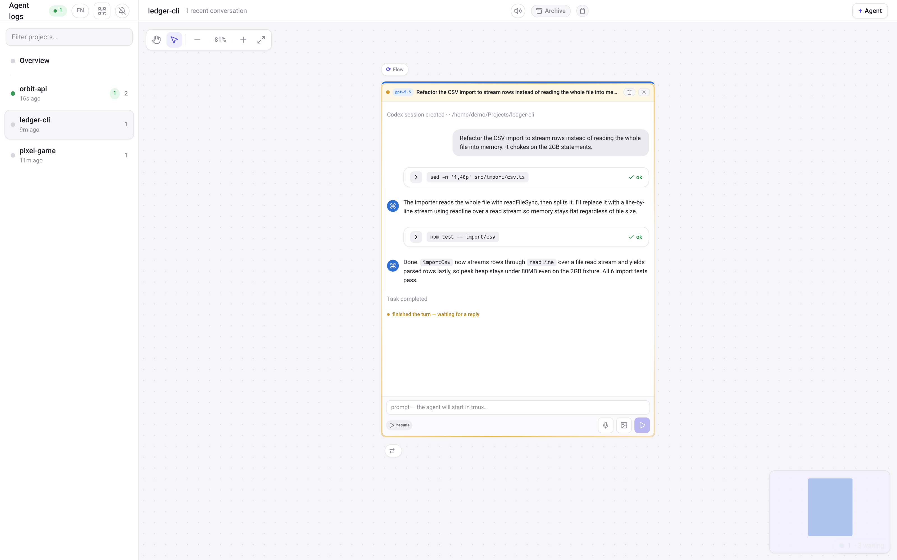
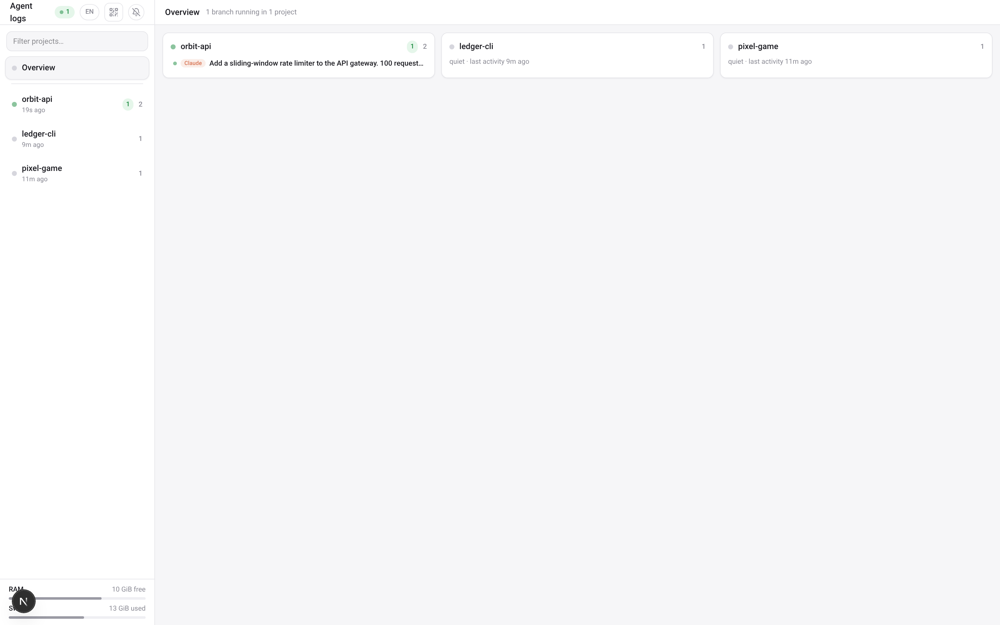

# Live Log Viewer

`agent-log-viewer` is a local web UI that turns raw Codex / Claude Code agent
logs into a readable, live-updating chat feed. It discovers every session,
subagent, Codex companion job and background shell task on your machine, links
them into a parent→child tree, and tails the selected one in real time.

Everything runs locally against files already on disk. There is no database and
no external service — the app reads `~/.claude` and `~/.codex` and renders what
it finds.


## What it shows

- **Claude Code sessions** (`~/.claude/projects/**/*.jsonl`) and their
  subagents, rendered as a chat: user bubbles, assistant prose, tool-call
  cards with ✓/✗ statuses and expandable output.
- **Codex CLI sessions** (`~/.codex/sessions/**/rollout-*.jsonl`) with command
  cards, patches and service events.
- **Codex companion jobs** (`~/.claude/plugins/data/codex-openai-codex/state`)
  with a one-click jump to the full rollout session behind each job.
- **Background shell tasks** (`claude-<uid>/**/tasks/*.output` under the OS
  temp dir — `/tmp` on Linux, `$TMPDIR` on macOS) — the originating Bash
  command is recovered from the session transcript and shown above the
  terminal output.

## Highlights

- **Parentage tree**: session → subagents → codex jobs → rollouts → background
  tasks, built server-side by scanning transcripts (append-only incremental,
  cached — the warm `/api/files` poll stays around 100 ms).
- **Live activity**: content-based badges — a transcript reads *working* while
  it is mid-turn and *done* once the final assistant message lands.
- **Deep links**: every selection is reflected in the URL (`#f=<path>`), so a
  link opens that exact log.
- **Project scheme**: each project is a pannable, zoomable diagram — the root
  conversation on top, spawned agents one generation below, arrows colored by
  engine. Quiet branches and tasks collapse under their nearest ancestor.
- **English or Ukrainian UI**, model chips (`fable-5`, `gpt-5.5`, `sonnet`…),
  collapsible tree with persisted state, follow-mode autoscroll, service-event
  toggle, and a line filter.

## Screenshots

The session parentage tree, wiring root conversations to their spawned agents:



| A Codex CLI session | The overview board |
| --- | --- |
|  |  |

## Run

The package is published to npm, so the quickstart needs no clone:

```bash
bunx agent-log-viewer
# or
npx agent-log-viewer
```

This starts the server on `127.0.0.1:8898` and opens your browser.

### From a local clone

With bun:

```bash
bun install
bun run build
bun start --port 8898 --hostname 127.0.0.1
# open http://127.0.0.1:8898/
```

With npm (note the `--` that forwards flags to the start script):

```bash
npm install
npm run build
npm start -- --port 8898 --hostname 127.0.0.1
```

`start` serves the output of the last `build`, so run `build` first. For
development, `bun dev` runs the app with hot reload (it needs a high OS
file-watch limit for large home directories).

**Prerequisites:** Node ≥ 20.9, and bun or npm/pnpm. `tmux` is optional — see
[Platform support](#platform-support).

### CLI options

```
agent-log-viewer [options]
```

| Option | Description |
| --- | --- |
| `-p, --port <n>` | Port for the local server (default `8898`). |
| `-H, --hostname <h>` | Bind address (default `127.0.0.1`). |
| `--tailscale` | Expose the viewer inside your tailnet (see below). |
| `--new-token` | Generate a fresh access key and invalidate old cookies. |
| `--no-open` | Don't open the browser on start. |
| `-v, --version` | Print the version. |
| `-h, --help` | Show usage. |

## Platform support

Linux is the native target: process discovery reads `/proc` directly. macOS is
supported through a portable backend that shells out to `ps` and `lsof`
instead — same live-process detection, tmux composer targeting, agent
spawn/kill and background-task discovery, just a bit more subprocess overhead
per scan. The backend is chosen automatically by `process.platform` (see
`src/lib/proc/`); `VIEWER_PROC_BACKEND=portable` forces the portable path on
Linux too, for testing.

The package supports Linux and macOS. The package's `os` field blocks Windows
installs with `EBADPLATFORM`. WSL works as Linux.

`tmux` is optional. Without it, log viewing, the parentage tree, live activity
and deep links all work; the composer, agent spawn/kill and resume-into-pane
features need tmux (`brew install tmux` on macOS, or your distro's package on
Linux).

## Language

The UI defaults to English and shows a compact EN/UK toggle in the project
list header. The locale is resolved as `localStorage` key `llv_lang` first,
then the browser language (Ukrainian if the browser prefers it), then English.

CLI messages are English by default, and switch to Ukrainian with
`LLV_LANG=uk` or a `uk_*` value in `LANG`/`LC_ALL`.

## Dictation / voice input

Composers that talk to agents have a mic button for dictating messages. By
default transcription runs fully locally via faster-whisper — no audio leaves
the machine. Run `scripts/setup-whisper.sh` once to install the local engine.

Two cloud backends are available as an explicit per-machine opt-in (never a UI
toggle): ChatGPT (reuses your local Codex login) and ElevenLabs Scribe (the
only one with live, streaming transcription). Select with
`LLV_TRANSCRIBE_BACKEND=local|chatgpt|elevenlabs` or by writing the backend
name to `~/.config/agent-log-viewer/transcribe-backend`; local is the default.

See [docs/transcription.md](docs/transcription.md) for setup, key locations,
and troubleshooting.

## Tailscale access

```bash
bunx agent-log-viewer --tailscale
```

`--tailscale` starts the local server on `127.0.0.1` and exposes it inside your
tailnet through a foreground `tailscale serve <port>` process. The public
internet (Funnel) is never used.

The CLI generates a 32-character access key, appends it to the tailnet URL as
`?k=...`, and after the first visit the server sets an `llv_auth` cookie for 30
days. `--new-token` generates a fresh key and immediately invalidates every old
cookie — each request compares the hash against the current token, so a cookie
minted with a previous key no longer passes.

The terminal prints the tailnet URL along with a QR code to scan with a phone.
The same QR is available inside the web UI: the QR-icon button in the project
list header opens a popover with the code and the link as text (with a copy
button). The QR is rendered entirely client-side (the `qrcode` package, no
external requests) and is served only to already-authorized clients — the same
token gate from `src/proxy.ts` also protects `/api/access`. When the server
runs without `--tailscale`, the button shows a hint to start
`bunx agent-log-viewer --tailscale`.

Anyone with tailnet access to this URL can read all agent transcripts,
including any sensitive data that landed in a session, and can execute commands
through `/api/tmux` and `/api/spawn`. Treat the tailnet URL as a secret — do
not forward it to anyone else.

## Security model

The log APIs refuse any path that does not resolve into one of the whitelisted
log roots (see `src/lib/scanner/roots.ts`). Mutating endpoints exist:
`/api/tmux` sends keys to tmux sessions and `/api/spawn` starts commands.

By default the CLI binds to `127.0.0.1`. With `--tailscale`, access is exposed
inside the tailnet via `tailscale serve` and guarded by the token gate in
`src/proxy.ts`. Non-loopback binds also force token mode. Treat any URL
containing `?k=` as a credential.

## Environment variables

All optional. Transcription variables are documented in full in
[docs/transcription.md](docs/transcription.md).

| Variable | Effect |
| --- | --- |
| `VIEWER_PROC_BACKEND` | `portable` or `linux` — force the process-discovery backend (auto-selected by default). |
| `LLV_LANG` | `uk` or `en` — force the CLI message language. |
| `LLV_TRANSCRIBE_BACKEND` | `local`, `chatgpt`, or `elevenlabs` — pick the dictation backend (default `local`). |
| `LLV_WHISPER_MODEL` | faster-whisper model size (default `small`). |
| `LLV_WHISPER_DEVICE` | `cpu` (default) or `cuda`. |
| `LLV_WHISPER_VENV` | Path to the whisper virtualenv (default `~/.cache/agent-log-viewer/whisper-venv`). |
| `LLV_ELEVENLABS_STT_MODEL` | ElevenLabs batch model override. |
| `ELEVENLABS_API_KEY` | ElevenLabs API key for the ElevenLabs backend. |

## Config paths

The viewer keeps its state under the standard XDG directories, named after the
package:

- `~/.config/agent-log-viewer/` — access `token`, `transcribe-backend`, and
  `elevenlabs-api-key`.
- `~/.cache/agent-log-viewer/whisper-venv` — the local transcription
  virtualenv.

Legacy `live-log-viewer` paths are still honored as read-only fallbacks, so
existing setups keep working without changes.

## Architecture

See [ARCHITECTURE.md](ARCHITECTURE.md): route handlers under `src/app/api/*`, a
pure scanner pipeline under `src/lib/scanner/*` (discover → describe → activity
→ model → links), React components under `src/components/*`. Caches live on
`globalThis` and survive dev hot-reload.

## License

MIT
